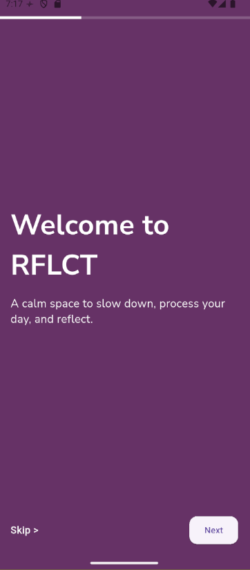
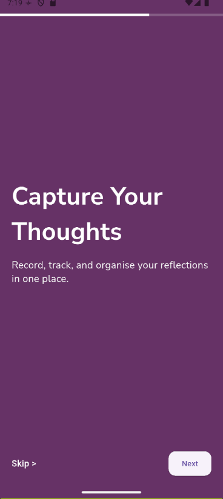
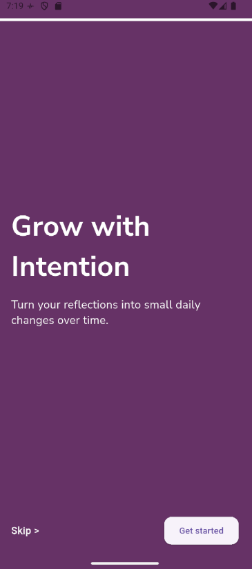
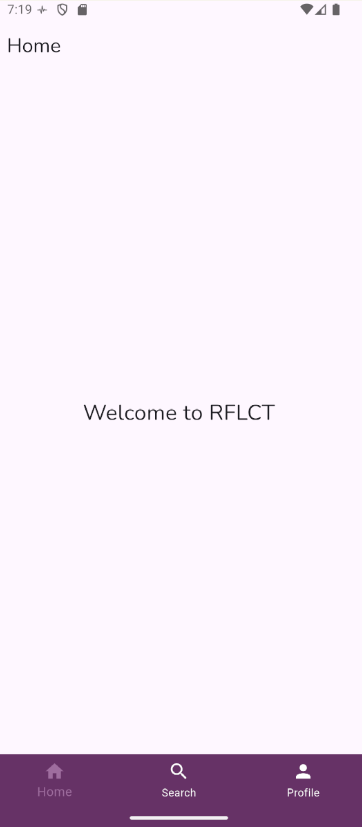

# REFLECT — Audio Journaling App

## Overview

**REFLECT (RFLCT)** is a Flutter-based mobile app designed for **audio journaling and reflection**.  
The app guides users into a calm, reflective experience with a simple and minimal UI.

Currently, the app includes:
- **Landing  Page** 

- **Onboarding Page** with 3 pages:
  - *Welcome to RFLCT* — introduces the app.

  - *Capture Your Thoughts* — explains recording, tracking, and organising reflections.

  - *Grow with Intention* — encourages small daily changes over time.

- **Top Progress Indicator Bar**:
  - A linear progress bar at the top showing how far the user is in the onboarding flow.
- **Skip & Next Controls**:
  - **Skip** text on the left to jump directly to the last onboarding page.
  - **Next** button on the right to move to the next page or proceed into the app.
- **Home Page Placeholder**:
  - A basic Home Page ready for adding audio journaling features (recording, playback, etc.).
  

---

 
 
## Project Structure
rflct/lib/main.dart # Entry point of the app /pages/loading_page.dart, onboarding_page.dart  , home_page.dart 


---

## Key Features Implemented

- **TweenAnimationBuilder**: For logo fade + scale effect
- **Timer**: Controls the 3–4 second wait before transitioning
- **PageRouteBuilder**: Custom slide-up + fade transition
- **Google Fonts**: Nunito font used throughout


---

## How to Run

1. Clone the repo:
```bash
git clone <repo-url>

cd rflct

flutter pub get

flutter run


