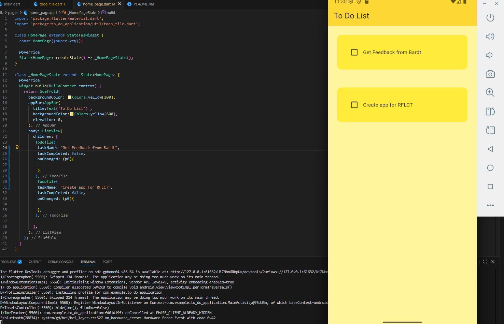

# 📝 To-Do Application (Flutter)

## Overview

This is a simple and clean **To-Do List application** built using Flutter.  
It demonstrates basic UI structure, component reuse, and task presentation using custom widgets.

The app is **incomplete** but currently includes:

- A Home Page displaying tasks
- Reusable `TodoTile` component
- Checkbox UI for marking tasks (logic coming soon)
- Bright yellow theme for a cheerful task-tracking experience

---

## ✨ Features (Current)

### ✔️ Home Page UI
- Yellow background (`Colors.yellow[200]`)
- `AppBar` with title **"To Do List"**
- List of tasks displayed using `ListView`
- Each task uses a custom `TodoTile` widget

### ✔️ TodoTile Component
The reusable widget that displays:

- A **checkbox**
- The **task name**
- A rounded container with padding for spacing

### ✔️ Basic Structure for Future State Management
- `onChanged` callback already included
- Ready for state updates (setState, provider, BLoC, Riverpod, etc.)

---

 

### **Home Page**

 


### **Home Page**
to_do_application/
  lib/
    main.dart
    pages/
      home_page.dart
    util/
      todo_tile.dart


## **🚧 Planned Features (Future)**

- Add new tasks using FloatingActionButton

- Delete tasks (swipe to dismiss)

- Edit task names

- Save tasks persistently using:

- Hive

- SharedPreferences

- SQLite

- Mark tasks as complete and store state

- App themes (light/dark)

- Polished UI animations


### ***How to run*
```bash
git clone <repo-url>

cd to_do_application

flutter pub get

flutter run
